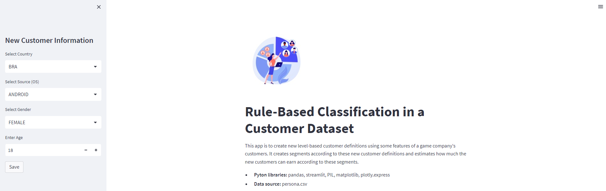
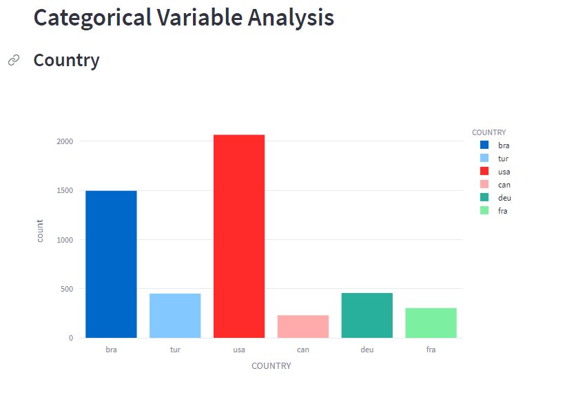
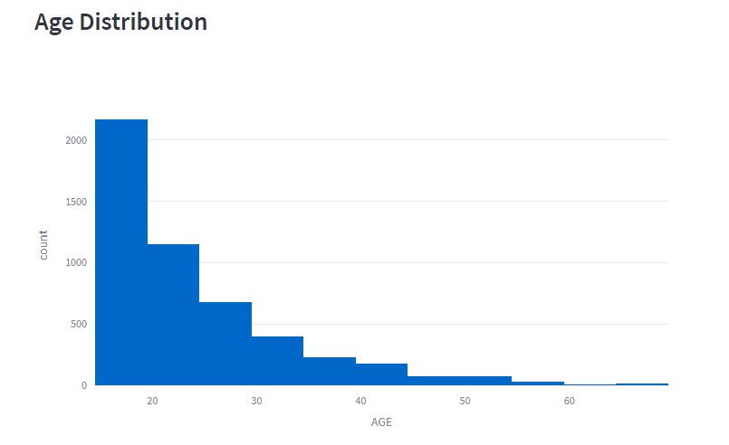
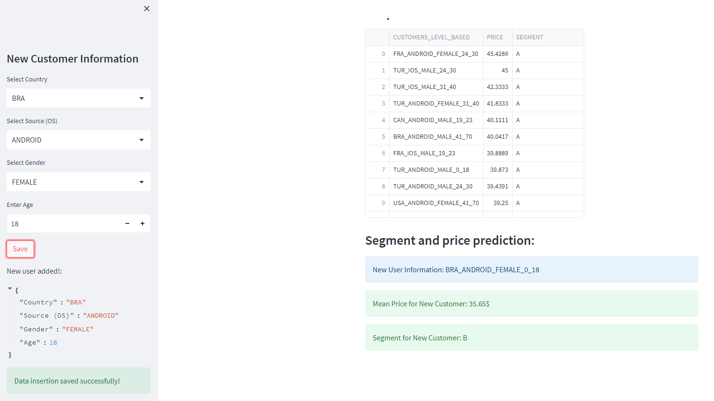

# Rule-Based Classification in a Customer Dataset

## What is Rule-Based Classification?

"Rule-based classification is a method of classifying data in a dataset based on specific rules. In this method, certain rules are established for classifying the data, and the data is classified based on these rules.

Rule-based classification is generally a simple and fast method. In this method, classification rules are predetermined, and the results are derived based on these rules. Therefore, rule-based classification can be an effective method, especially for small data sets."

## Business Case

"A game company wants to create new level-based customer definitions (personas) by using some features of its customers, and to create segments according to these new customer definitions and to estimate how much new customers can earn on average according to these segments.

For example:
It is desired to determine how much a 25-year-old male user from Turkey, who is an IOS user, can earn on average.

- Note: After entering the customer information Country, Sex, OS (Operationing System) and Age, it is desired to determine how much this new customer can earn on average and in which segment."

## The story of the dataset

"The Persona.csv dataset contains the prices of the products sold by an international game company and some demographic information of the users who buy these products. The data set consists of records created in each sales transaction. This means that the table is not deduplicated. In other words, a user with certain demographic characteristics may have made more than one purchase."

- **PRICE:** Customer's spending amount
- **SOURCE:** The type of device the customer is connecting to
- **SEX:** Gender of the customer
- **COUNTRY:** Customer's country
- **AGE:** Customer's age

## Methods and libraries used in the project

- Pandas, Streamlit, PIL, Matplotlib, Plotly
- EDA (Exploratory Data Analysis)
- Segmentation and forecasting

## Some screenshots from the project

  

  

  

  

## Requirements.txt

- Please review the 'requirements.txt' file for required libraries.

## Conclusion

- ⭐ Please don't forget to STAR if you liked the project or it was useful for you. 😊

